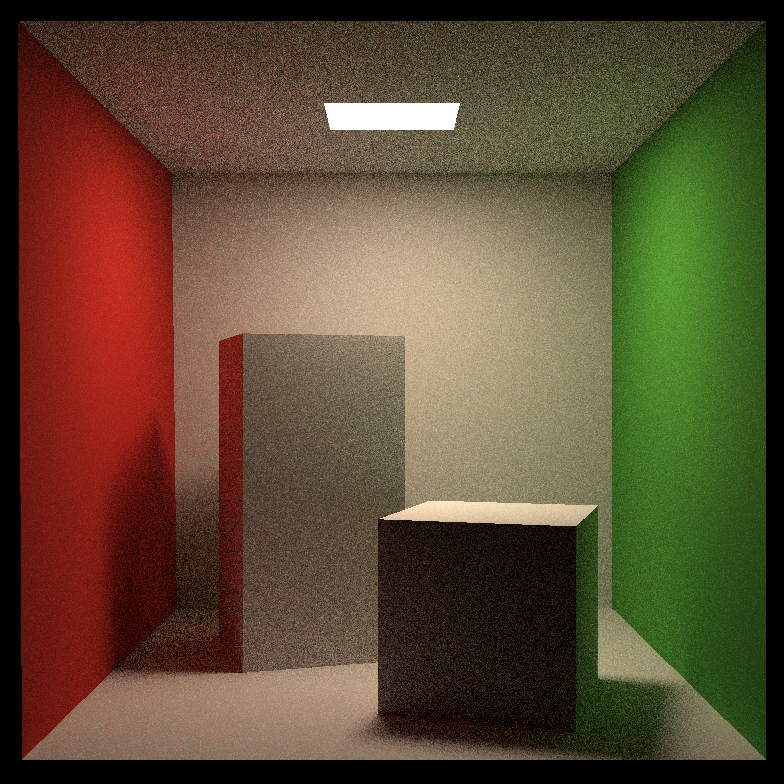
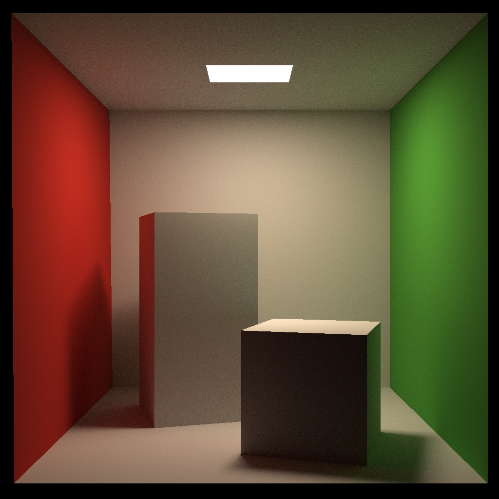

# GAMES101 Assignment 7

## Features Implemented

| Name                                                         | Score |
| ------------------------------------------------------------ | ----- |
| Runnable Implementation                                      | 5     |
| Path Tracing (SPP>8, resolution > 512x512)                   | 45    |
| Multi-Threaded Rendering                                     | 10    |
| Microfacet Implementation (Reflection and Transmission, **Beckmann** and **Trowbridge-Reitz**) | 10    |
| Other Materials: Fresnel Reflection/Transmission/Specular (**Conductor** and **Dielectric**) |       |

## Demonstration

Images are stored under the `images` folder.

### Basic Part & Parallelization

The specification of the test platform is listed as follows.

| Subject | Value                                       |
| ------- | ------------------------------------------- |
| CPU     | AMD Ryzen 7 5800H @3.20 GHz, 8c16t          |
| RAM     | DDR4 3200 MHz SODIMM                        |
| OS      | Ubuntu 22.04.2 LTS on Windows 10 x86_64     |
| Kernel  | 5.15.90.1-microsoft-standard-WSL2           |
| g++     | g++ (Ubuntu 11.3.0-1ubuntu1~22.04.1) 11.3.0 |

| Options                                                      | Time (ms) |
| ------------------------------------------------------------ | --------- |
| None                                                         | 1149167   |
| With parallelization, No MSAA                                | 101064    |
| With parallelization, MSAA 4x                                | 384347    |
| With parallelization, No MSAA, *optimized random FP generation* | 3286      |
| With parallelization, MSAA 4x, *optimized random FP generation* | 12313     |

Target Solution: 784x784, SPP=16, One-Time Test

*Optimized random FP generation: For each thread a single random number generator is allocated, thus avoiding **repeatedly** generating random device and engine.*

From now on we assume optimized random FP generation is used.

| Options                   | Image                                                        |
| ------------------------- | ------------------------------------------------------------ |
| 784x784                   |  |
| 784x784 MSAA4x            |  |
| 784x784 SPP=1024, No MSAA |  |

| Options             | Time (ms) |
| ------------------- | --------- |
| 1024x1024, SPP=16   | 5751      |
| 1024x1024, SPP=256  | 91198     |
| 1024x1024, SPP=1024 | 367022    |

Parallelization, Dynamic, No MSAA, One-Time Test

| Options             | Image                                                     |
| ------------------- | --------------------------------------------------------- |
| 1024x1024, SPP=16   |    |
| 1024x1024, SPP=256  |   |
| 1024x1024, SPP=1024 |  |

### Fresnel Reflection/Transmission/Specular

| R                                                            | T                                                            | S                                                            |
| ------------------------------------------------------------ | ------------------------------------------------------------ | ------------------------------------------------------------ |
|  |  |  |

784x784, SPP=1024

### Microfacet Reflection

#### Reflection

##### Beckmann Distribution

| 0.00                                         | 0.01                                            | 0.1                                           | 0.3                                           | 0.5                                           | 0.7                                           | 1.0                                           |
| -------------------------------------------- | ----------------------------------------------- | --------------------------------------------- | --------------------------------------------- | --------------------------------------------- | --------------------------------------------- | --------------------------------------------- |
|  |  |  |  |  |  |  |

*Top column: Roughness $\in [0, 1]$*

##### Trowbridge-Reitz Distribution

| 0.00                                         | 0.01                                            | 0.1                                           | 0.3                                           | 0.5                                           | 0.7                                           | 1.0                                           |
| -------------------------------------------- | ----------------------------------------------- | --------------------------------------------- | --------------------------------------------- | --------------------------------------------- | --------------------------------------------- | --------------------------------------------- |
|  |  |  |  |  |  |  |

*Top column: Roughness $\in [0, 1]$*

### Bunnies: Fresnel Reflection/Specular, Microfacet Reflection/Transmission/Specular

#### Fresnel Reflection/Specular

#### Microfacet Reflection/Transmission/Specular

*Roughness = 0.01*

*Specular: Some unknown bugs are present.*

## Implementation Details

### General Advice (from Trials)

#### FP Precision

- When intersecting with bounding boxes, consider the extreme cases (bounding box deteriorates into a single plane).
  - *Phenomenon: Planes may disappear*
- When intersecting with triangles, reverse the direction of surface normal if necessary.
  - *Phenomenon: Triangles may disappear*
  - *Why: Triangles defined in the framework have one normal only*
- When shooting rays from the surface of a material, add enough tolerance on intersection test.
  - *Phenomenon: Surfaces may appear in total black or partial black*
  - *Why: Rays may intersect with the differential plane its origin resides on*

#### `castRay`

- Truncate `hitColor` if it is too large.
  - *Phenomenon: White noise*

### Multi-Threading

#### Cautions

##### Do not create random engine upon each function call

Under the platform previously mentioned, the speedup can be 34x (784x784 resolution, 16 SPP, from 102 seconds to 3 seconds).

##### Do not frequently update the progress bar in multiple threads

As `cout` must be synchronized to produce sensible output.

#### Implementation

- The entire scene is sampled multiple times, one time in each thread using `std::async`.
  - Multiple concurrent sampling task are issued simultaneously. The number equals to the result from `std::thread::hardware_concurrency()`. Issuing stops when the number of fired tasks reaches SPP.
  - When returned, these results will be moved to a temporary buffer for storage.
  - Upon completion of all sampling tasks, a single task is issued to combine the results.

- `std::mutex` to create a global lock for updating progress.
- `std::condition_variable` to send signals to blocked threads (that are waiting to update the progress and write to console).

### Microfacet Model

#### Theory

View `Lecture17.md`, Appendix A: Microfacet Models, which provides a brief summary about how it is done in PBRT book.

**Beckmann** and **Trowbridge-Reitz** Distributions are used.

### Fresnel Models

Following tutorials on the website of PBRT book.

