# GAMES101 Lecture 17 - Materials and Appearances

## I. Materials and Apperances

Textures and appearances are closely related:

- Under different lighting conditions textures appears to be different.

Some of the features from natural materials:

- **Water**
- **Scattering**
- **Hair/Fur**
- **Clothes**
- **Subsurface Scattering** (SSS)
- ...

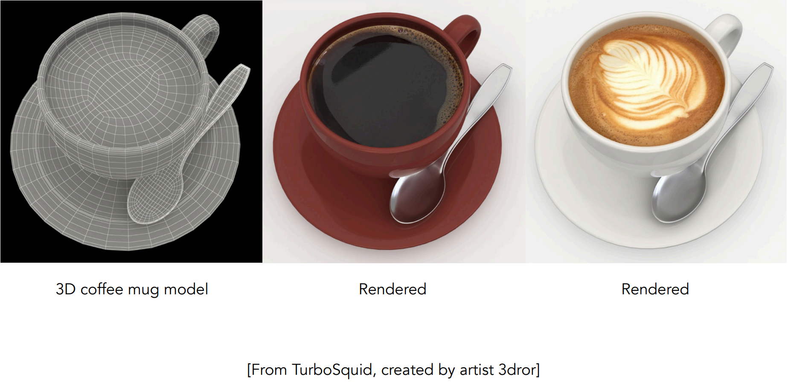

The term **material** is equivalent to **BSDF**.

**Bidirectional Scattering Distribution Function, BSDF**

- The generalization of BRDF and BTDF (**Bidirectional Transmittance Distribution Function**), which takes both refraction and reflection into consideration.

### Diffuse/Lambertian Material

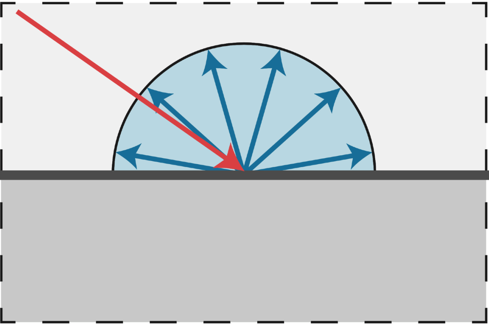

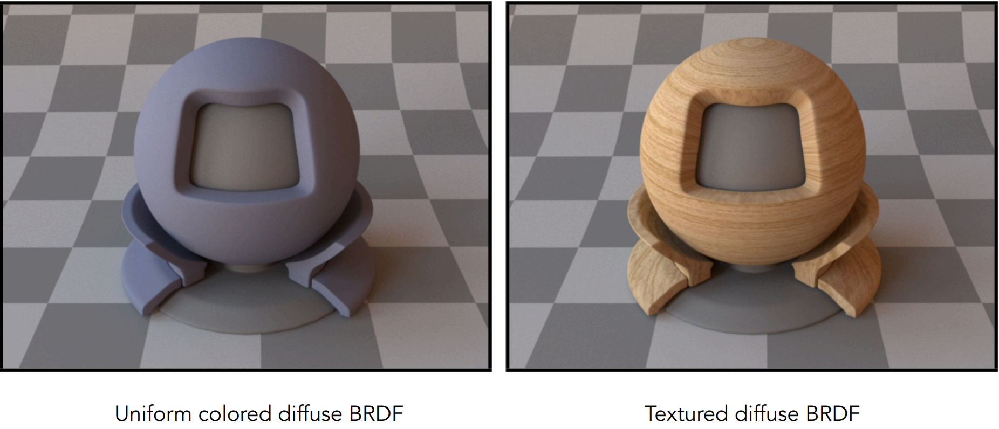

From [Mitsuba render, Wenzel Jakob, 2010

Light is **equally** reflected in each output direction.

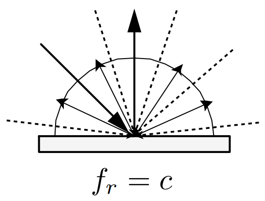

Suppose the incident lighting is **uniform in radiance**, and without self-emission we have:
$$
\begin{align}
L_o (\omega_o) &=
\int_{H^2} f_r L_i (\omega_i) \cos{\theta_i} \dd{\omega_i} \\
&=
f_r L_i \int_{H^2} \cos{\theta_i} \dd{\omega_i} 
\quad \text{(since $\dd{\omega_i} = \dd{A} = \sin{\theta}\dd{\theta}\dd{\phi} $)}
\\
&=
\pi f_r L_i \\

\end{align}
$$
If the material absorbs no light, then $f_r = 1/\pi$.

On lambertian material we have
$$
f_r = \frac{\rho}{\pi}, \quad 0 \leq \rho \leq 1
$$
in which $\rho$ is called **albedo**, or color.

### Glossy Material

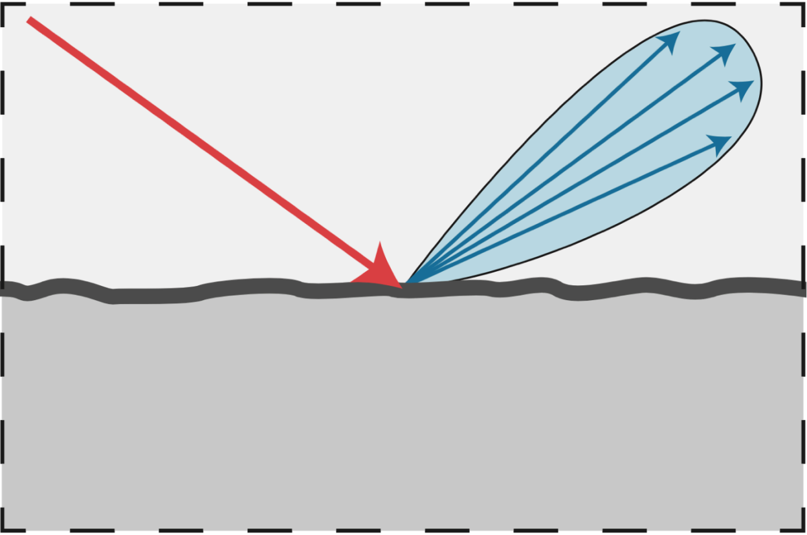

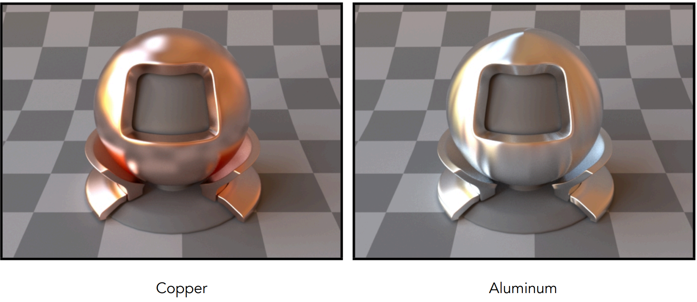

From [Mitsuba render, Wenzel Jakob, 2010

### Ideal Reflective/Refractive Material

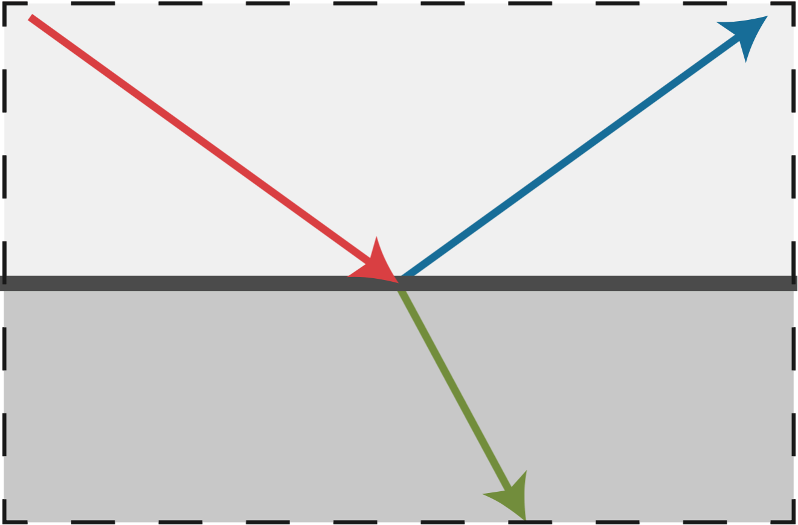

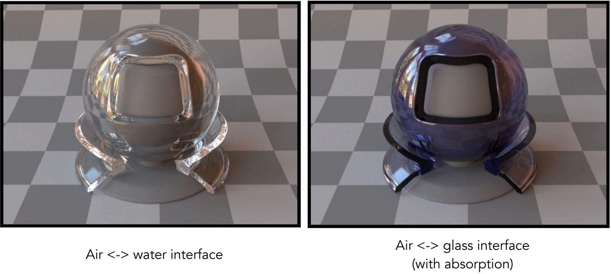

From [Mitsuba render, Wenzel Jakob, 2010

- Part of the spectrum is absorbed by the underlying material.

### Perfect Specular Reflection

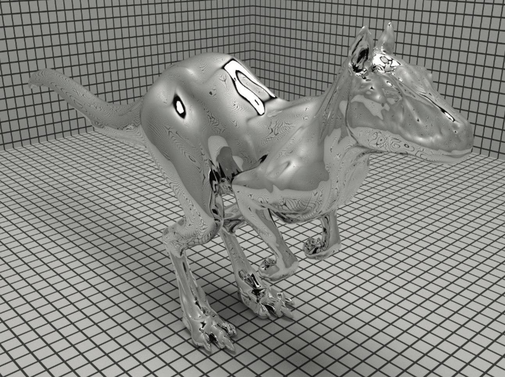

From PBRT

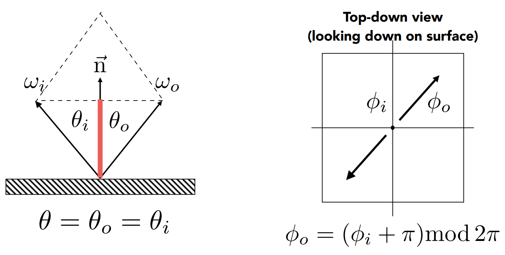
$$
\omega_o + \omega_i = 2 \cos{\theta} ~ \vec{n} = 2(\omega_i \cdot \vec{n}) \vec{n}
$$

$$
\omega_o = - \omega_i + 2 (\omega_i \cdot \vec{n}) \vec{n}
$$

$\theta$ and $\phi$ are obtained from the local coordinate system.

**BRDFs** for the perfect specular reflection are difficult to write.

- Related to the $\delta$ function

### Specular Refraction

Light refracts when it enters a new medium.

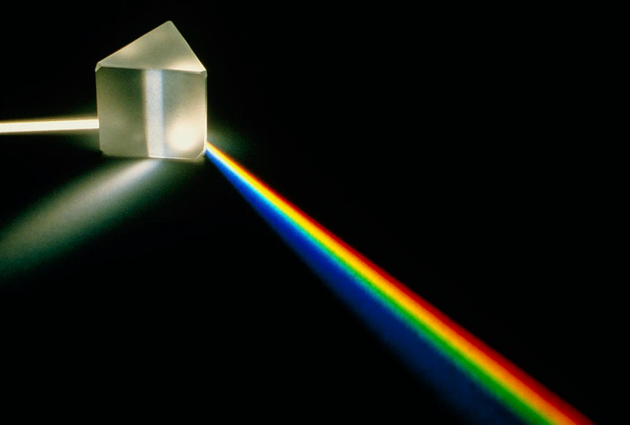

#### Snell's Law

Transmitted angle depends on

- **index of refraction (IOR)** for incident ray
- IOR for exiting ray

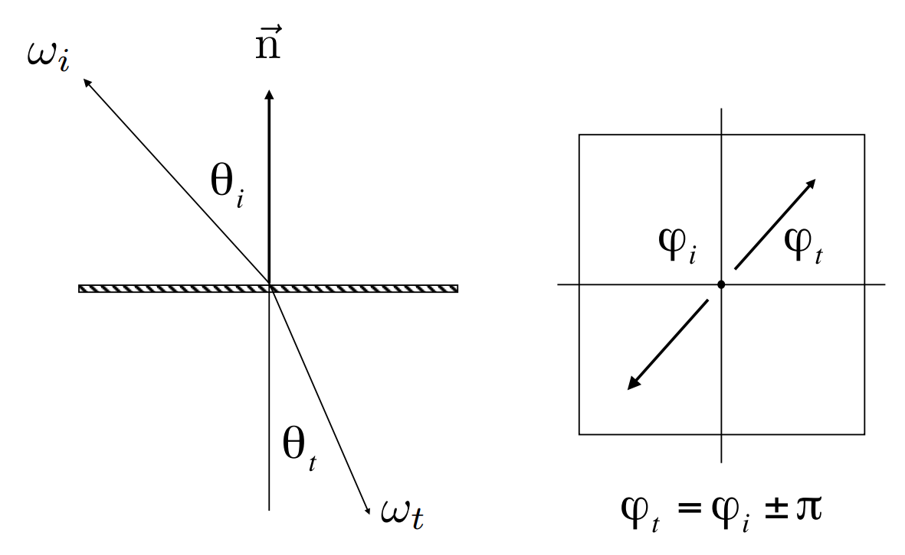
$$
\eta_i \sin{\theta_i} = \eta_t \sin{\theta_t}
$$

| Medium      | Vaccum | Air (sea level) | Water ($20 \degree \text{C}$) | Glass   | Diamond |
| ----------- | ------ | --------------- | ----------------------------- | ------- | ------- |
| $\eta^\ast$ | 1.0    | 1.00029         | 1.333                         | 1.5-1.6 | 2.42    |

*Index of frefraction is wavelength dependent. These are **averages***.

#### Law of Refraction

$$
\begin{align}
\eta_i \sin{\theta_i} 
&= 
\eta_t \sin{\theta_t} \\
\cos{\theta_t} 
&= 
\sqrt{1 - \sin^2 \theta_t} \\
&=
\sqrt{1 - \left(\frac{\eta_i}{\eta_t}\right)^2 \sin^2 \theta_i} \\
&=
\sqrt{1 - \left(\frac{\eta_i}{\eta_t}\right)^2 (1 - \cos^2 \theta_i)} \label{total_internal_reflection} \tag{1} \\ 
\end{align}
$$

***Definition***: **Total internal reflection**: When light is moving from a more optically dense medium to a less optically dense medium, i.e., 
$$
\frac{\eta_i}{\eta_t} > 1
$$
then light incident on boundary from large enough angle will not exit the medium. The critical angle can be computed from equation $\ref{total_internal_reflection}$ by substituting $\theta_t = \pi / 2$ into the equation.

- **Snell's Window/Circle**

  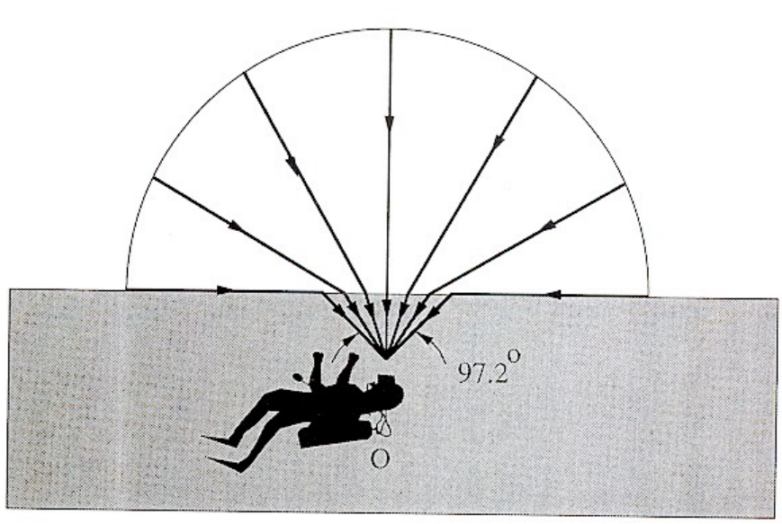

### Fresnel Reflection/Term

Reflectance depends on **incident angle** (and **polarization** of light).

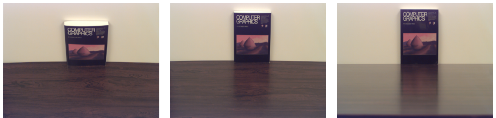

This example: reflectance increases with grazing angle [Lafortune et al. 1997]

#### Fresnel Term

- **Polarization**: The component of the electric field parallel to the incidence plane is termed *p-like* (parallel) and the component perpendicular to this plane is termed *s-like* (from *senkrecht*, German for perpendicular). (Wikipedia)

**Dielectric**, $\eta = 1.5$:

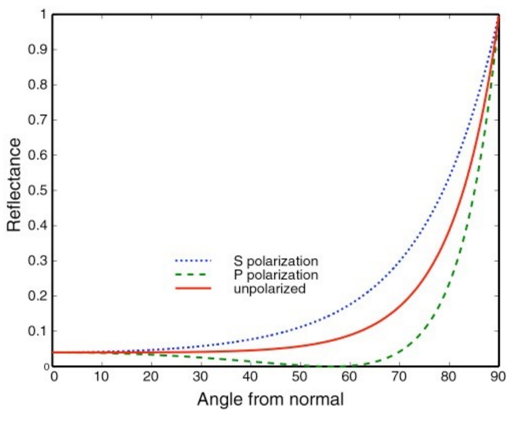

**Conductor**:

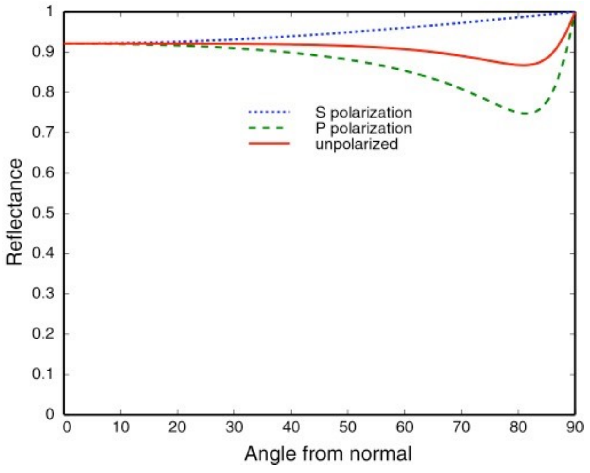

- **Conductors** have negative indices of refraction.

##### Formulae

**Accurate**: **polarization** taken into consideration

$n$ is related to $\eta$, the intrinsic property of the material.
$$
R_S 
= 
\abs{
    \frac{
    	n_1 \cos \theta_i - n_2 \cos \theta_t}
    	{n_1 \cos \theta_i  + n_2 \cos \theta_t
    }
}^2
=
\abs{
	\frac{
		n_1 \cos \theta_i - n_2 \sqrt{1 - \left( \frac{n_1}{n_2} \sin \theta_i \right)}
	}{
		n_1 \cos \theta_i + n_2 \sqrt{1 - \left( \frac{n_1}{n_2} \sin \theta_i \right)}
	}
}^2
$$

$$
R_P
= 
\abs{
    \frac{
    	n_1 \cos \theta_t - n_2 \cos \theta_i}
    	{n_1 \cos \theta_t  + n_2 \cos \theta_i
    }
}^2
=
\abs{
	\frac{
		n_1 \sqrt{1 - \left( \frac{n_1}{n_2} \sin \theta_i \right)} - n_2 \cos \theta_i
	}{
		n_1 \sqrt{1 - \left( \frac{n_1}{n_2} \sin \theta_i \right)} + n_2 \cos \theta_i
	}
}^2
$$

$$
R_\text{eff} = \frac{1}{2} (R_S + R_P)
$$

**Approximate**: Schlick's approximation
$$
R(\theta) = R_0 + (1 - R_0)(1 - \cos \theta)^5
$$

$$
R_0 = \left(\frac{n_1 - n_2}{n_1 + n_2} \right)^2
$$

### Microfacet Material

*State of art*.

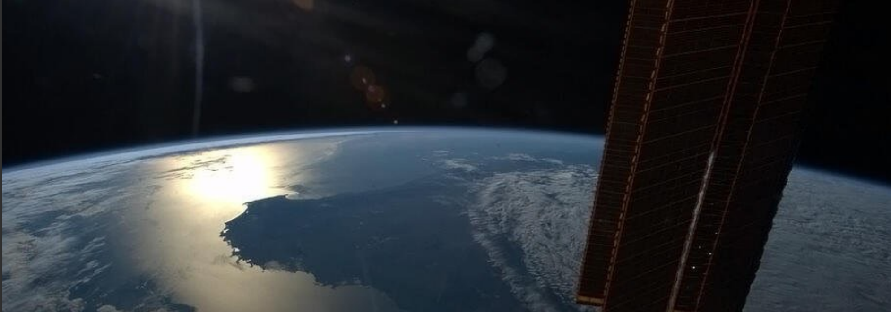

#### Microfacet Theory

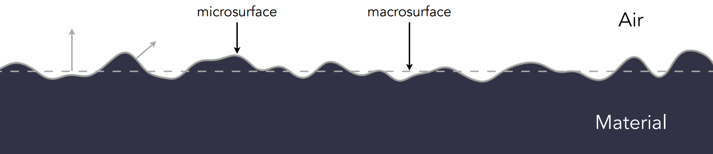

Rough surface:

- Macroscale: flat & rough
- Microscale: bumpy & **specular**

**Microfacet**: individual elements of surface act like *mirrors*

**Key**: The **distribution** of their **normals**. Each microfacet has its own normal.

- Concentrated <==> Glossy

  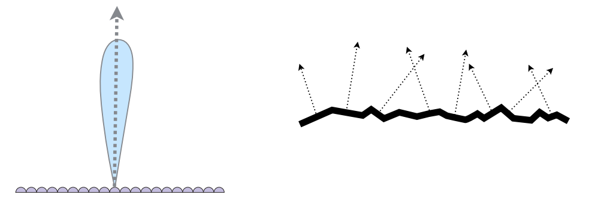

  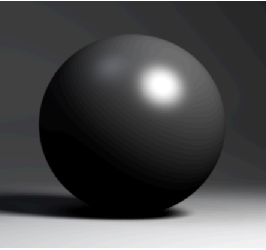

- Spread <==> Diffuse

  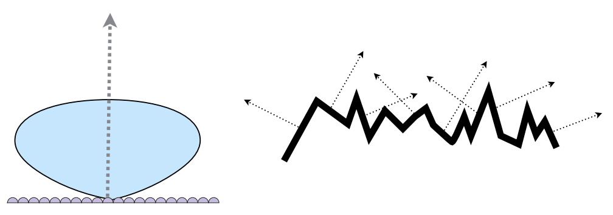

  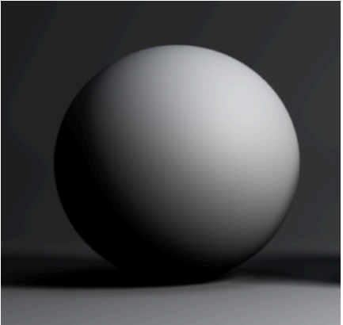

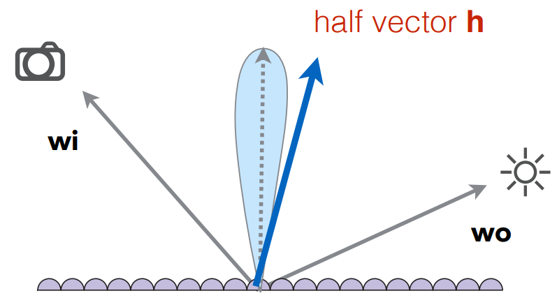

**Microfacet BRDF**:
$$
f(\omega_i, \omega_o) =
\frac{
	\text{F}(\omega_i, \textbf{h})
	\textbf{G}(\omega_i, \omega_o, \textbf{h}) 
	\textbf{D}(\textbf{h})
}{
	4 (\textbf{n}, \omega_i) (\textbf{n}, \omega_o)
}
$$
In which:

- $\text{F}$ is the Fresnel term
- $\textbf{G}$ is the shadowing-masking term
  - *Microfacets may **block** each other*.
  - *Happens often when lights are near the **grazing angle***.

- $\textbf{D}$ is the distribution of normals
  - *How many normals are there that match the direction of $\textbf{h}$*?

### Isotropic/Anisotropic Materials (BRDFs)

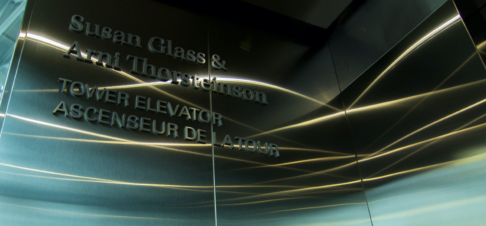

**Key**: **Directionality** of the underlying surface.

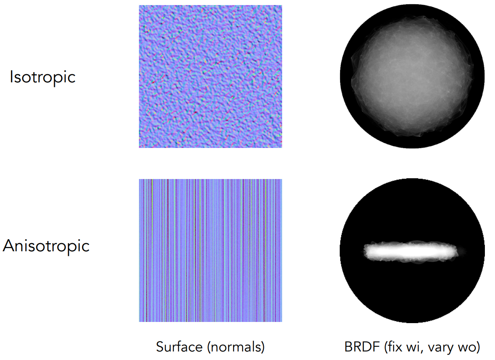

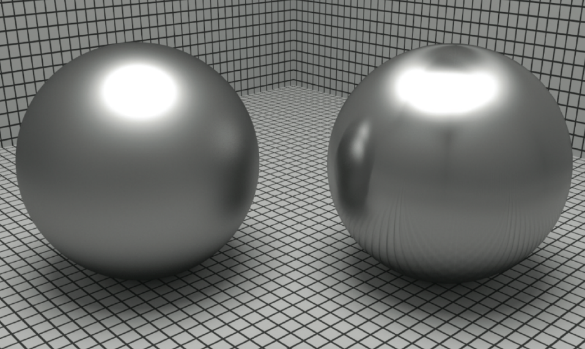

**Anisotropic**: Reflection depends on **azimuthal angle** $\phi$
$$
f_r(\theta_i, \phi_i; \theta_r, \phi_r) \neq f_r (\theta_i, \theta_r, \phi_r - \phi_i)
$$

- Results from **oriented microstructure** of the surface, e.g.
  - Brushed Metal
  - Nylon
  - Velvet

## II. Further on BRDFs

### Properties of BRDFs

- **Non-negativity**: On any point, $f_r$ is always non-negative.
  $$
  f_r (\omega_i, \omega_r) \geq 0
  $$

- **Linearity**: BRDFs can be directly summed.
  $$
  L_r (\text{p}, \omega_r)
  =
  \int_{H^2} f_r (\text{p}, \omega_i, \omega_r) L_i (\text{p}, \omega_i)
  \cos \theta_i
  \dd{\omega_i}
  $$
  The nature of integration make BRDFs addable.
  
  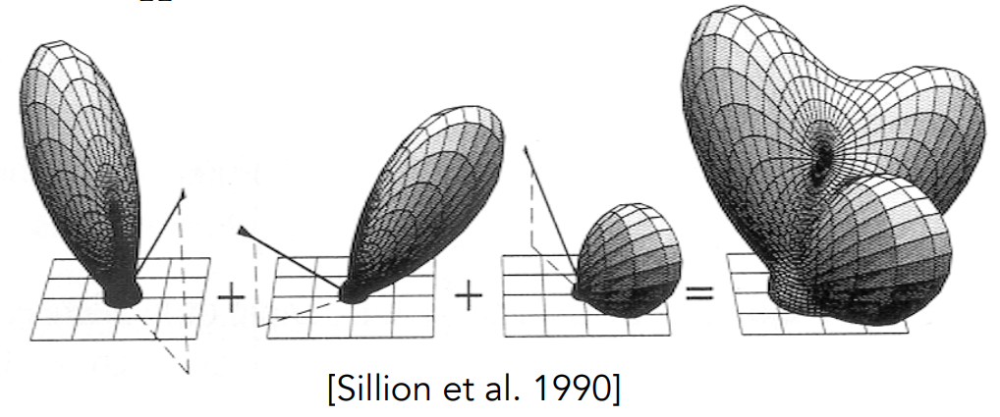
  
- **Reciprocity Principle**
  $$
  f_r (\omega_r, \omega_i) = f_r (\omega_i, \omega_r)
  $$
  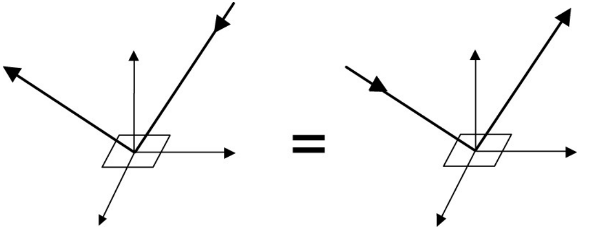

- **Energy Conservation**
  $$
  \forall \omega_r,
  \quad
  \int_{H^2} f_r (\omega_i, \omega_r) \cos \theta_i \dd{\omega_i} \leq 1
  $$

- **Isotropic/Anisotropic**

  - If isotropic: $f_r (\theta_i, \phi_i; \theta_r, \phi_r) = f_r (\theta_i, \theta_r, \phi_r - \phi_i)$, which essentially means that **the dimension of BRDF is reduced by 1.**

    Then from reciprocity we have
    $$
    f_r (\theta_i, \theta_r, \phi_r - \phi_i) = f_r (\theta_r, \theta_i, \phi_i - \phi_r) = f_r (\theta_i, \theta_r, \abs{\phi_r - \phi_i})
    $$
  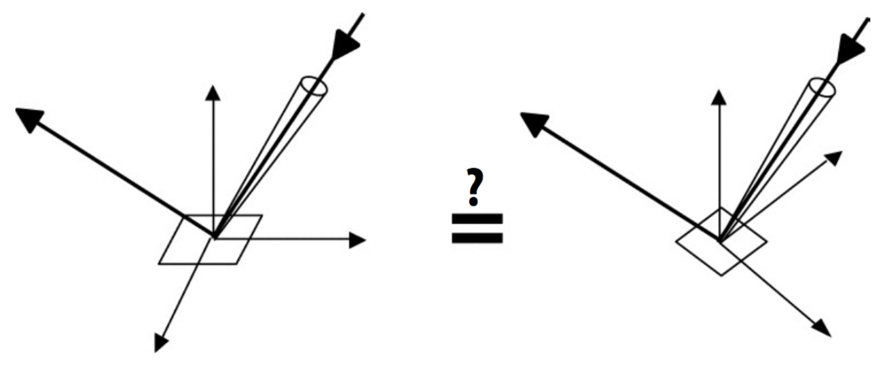

### Measuring BRDFs

Target:

- Avoid need to develop/derive models
  - Automatically includes all of the scattering effects present
- Can accurately render with real-world materials
  - Useful for product design, special effects, ...

#### General Approach

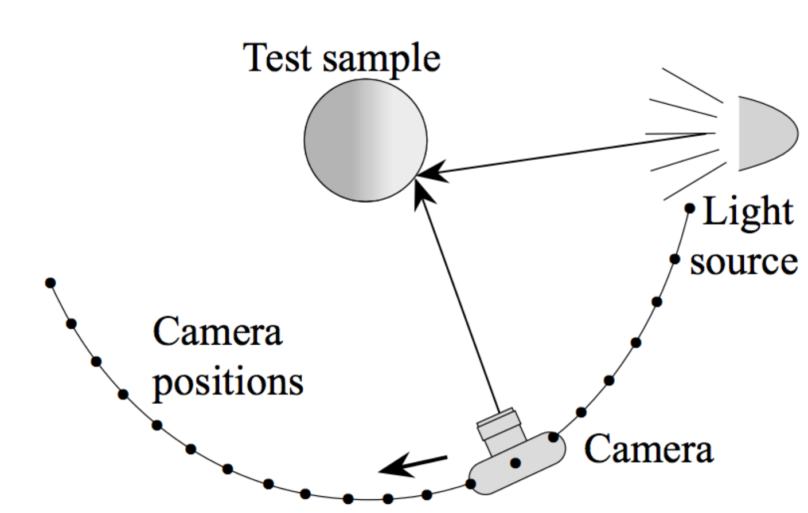

- For each outgoing direction $\omega_o$
  - move light to illuminate surface with a thin beam from $\omega_o$
  - For each incoming direction $\omega_i$
    - move sensor to be at direction $\omega_i$ from surface
    - measure incident radiance

**Gonioreflectometer**:

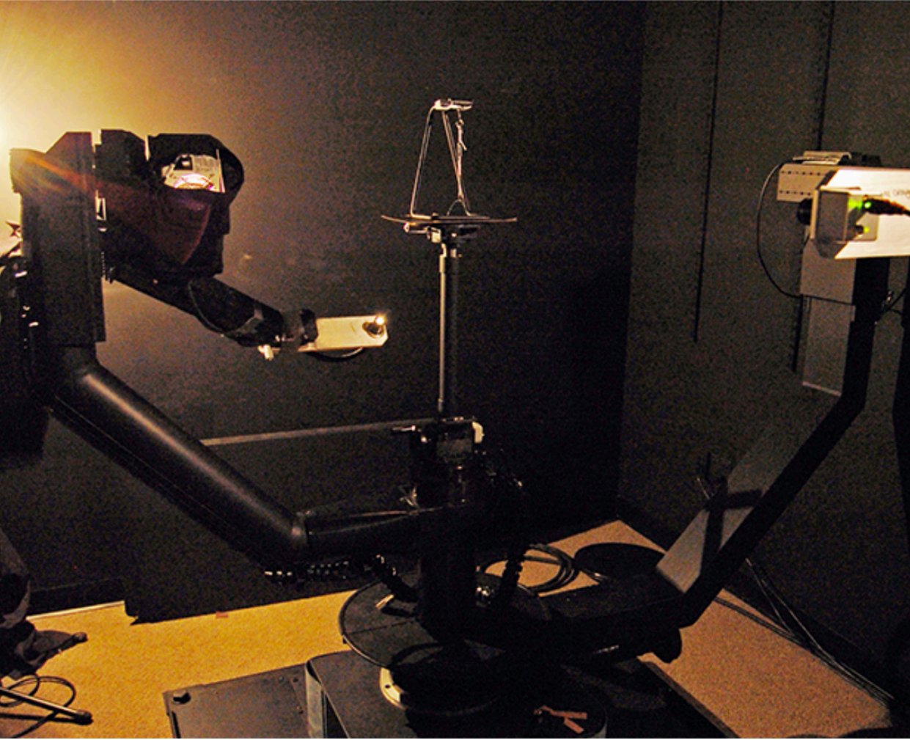

Spherical gantry at UCSD

#### Improving Efficiency

- Isotropic surfaces reduce dimensionality from 4D to 3D
- Reciprocity reduces # of measurements by half
- Clever optical systems

#### Challenges

- Accurate measurements at grazing angles
  - Important due to Fresnel effects
- Measuring with dens enough sampling to capture high frequency specularities
- Retro-reflection
- Spatially-varying reflectance
- ...

#### Representing Measured BRDFs

Desirable qualities:

- Compact representation
- Accurate representation of measured data
- Efficient evaluation for arbitrary pairs of directions
- Good distributions available for importance sampling

#### Tabular Representation

**MERL BRDF Database** [Matusik et al. 2004], $90 \times 90 \times 180$ measurements

Store regularly-spaced samples in $(\theta_i, \theta_o, \abs{\phi_i - \phi_o})$

- **Better**: reparameterize angles to better match specularities

- Generally need to resample measured values to table
- **Very high** storage requirements

## Appendix A: Microfacet Models

