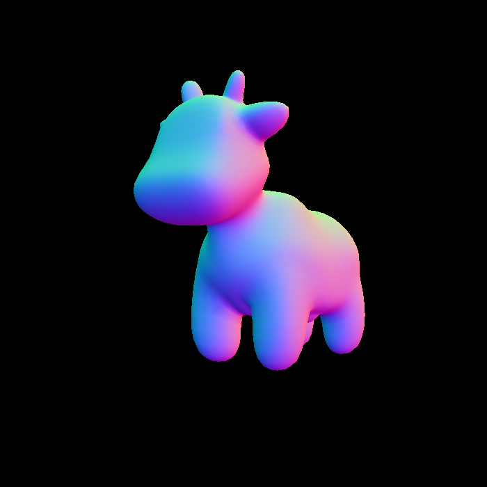
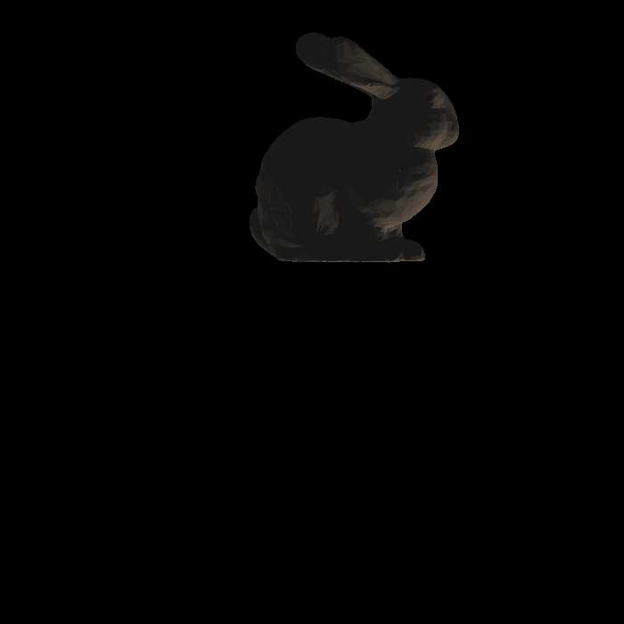
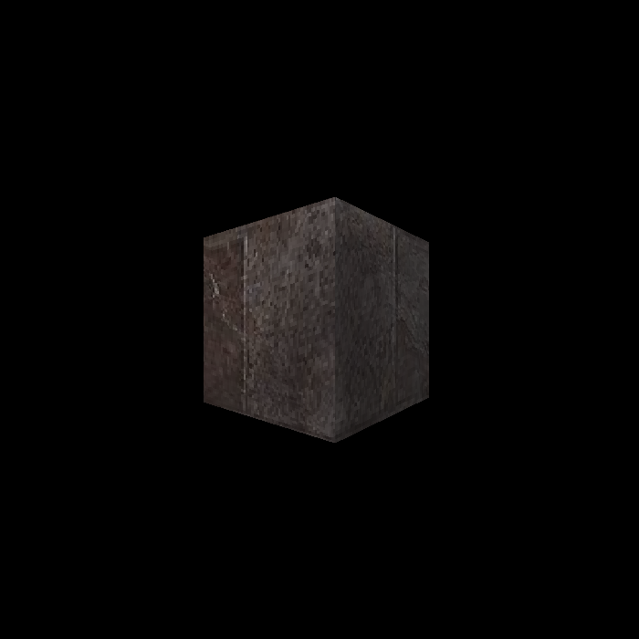

# GAMES101 Assignment 3
## Features Implemented

| Name                                                         | Score |
| ------------------------------------------------------------ | ----- |
| Runnable Implementation                                      | 5     |
| Interpolations: Colors, Normal Vectors, Texture Coordinates, Shading Positions | 10    |
| Blinn-Phong Reflectance Model                                | 20    |
| Texture Mapping                                              | 5     |
| Bump Mapping & Displacement Mapping                          | 10    |
| More Models!                                                 | 3     |
| Bilinear Texture Interpolation                               | 5     |


## Demonstration

### Bilinear Interpolation
Before:


After:


### Spot



### Bunny




### Cube





### Rock


## Known issues related to the framework

1. Inside function `phong_fragment_shader`,
   ```
        Eigen::Vector3f v = (eye_pos - point).normalized(); // WARNING: Calculating eye_pos in world space with shading point from view space.
   ```
   is an incorrect implementation, as the comment suggests. However, this leads to the result that matches the sample image in the Assignment description.
2. Unspecified coordinate space for `light.position`s. Assuming they are all in the view space.
3. Interpolation done in viewport space rather than in the view space.


## Known problems

1. Why do we calculate the ambient lighting for each light source instead of applying it for only once?
2. Self-implemented perspective correct interpolation resulted in unexpected artifacts.
3. Added `0.5f` offset to `(u, v)` coordinate to avoid invalid coordinate accesses.