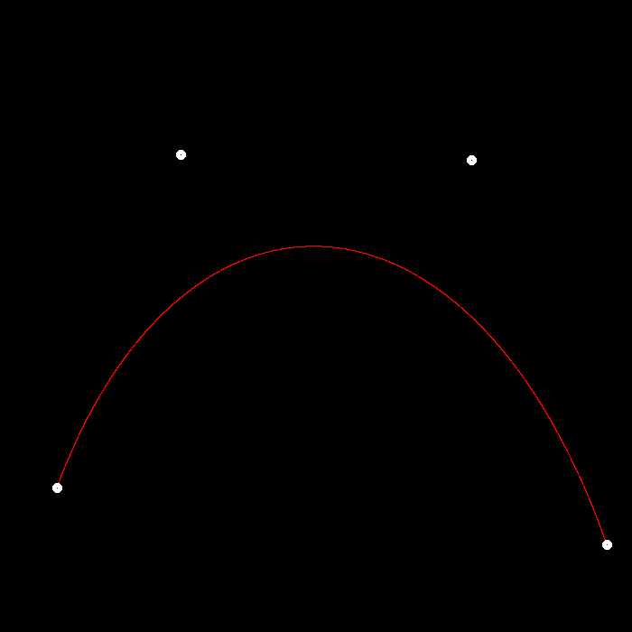

# GAMES101 Assignment 4
## Features Implemented

| Name                               | Score |
| ---------------------------------- | ----- |
| Runnable Implementation            | 5     |
| De Casteljau Algorithm             | 20    |
| Anti-aliasing for the Bézier curve | 5     |

## Demonstration

Before anti-aliasing:

After anti-aliasing:

