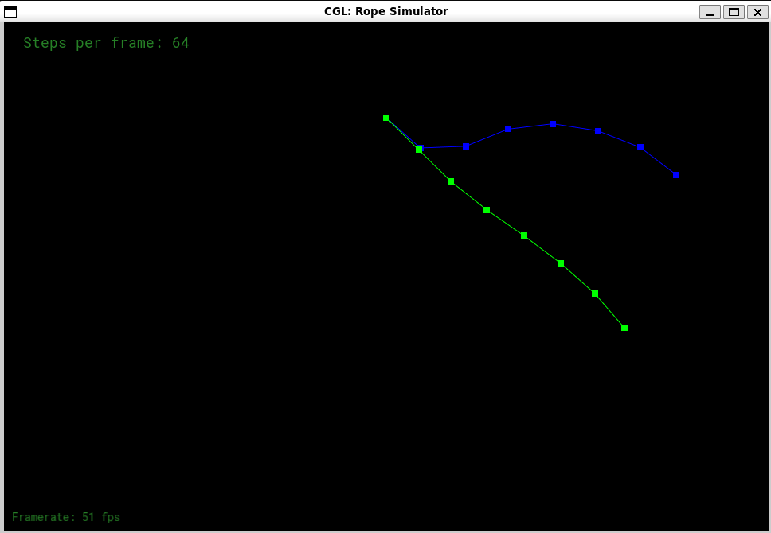

# GAMES101 Assignment 8

## Features Implemented

| Name                                                       | Score |
| ---------------------------------------------------------- | ----- |
| Runnable Implementation                                    | 5     |
| Correct Implementation of the Constructor for `class Rope` | 5     |
| Semi-Implicit Euler Method                                 | 5     |
| Explicit Euler Method                                      | 5     |
| Explicit Verlet Method                                     | 10    |
| Damping (Both in Euler Method and in Verlet Method)        | 5     |

## Demonstration

For animation, please make the project.

Required libraries: **OpenGL**, `libglfw-dev`, `libglew-dev`, `mesa-utils`, `mesa-common-dev`, `libglu1-mesa-dev`, `freeglut3-dev`, `xorg-dev`, `libfreetype6-dev`.

 