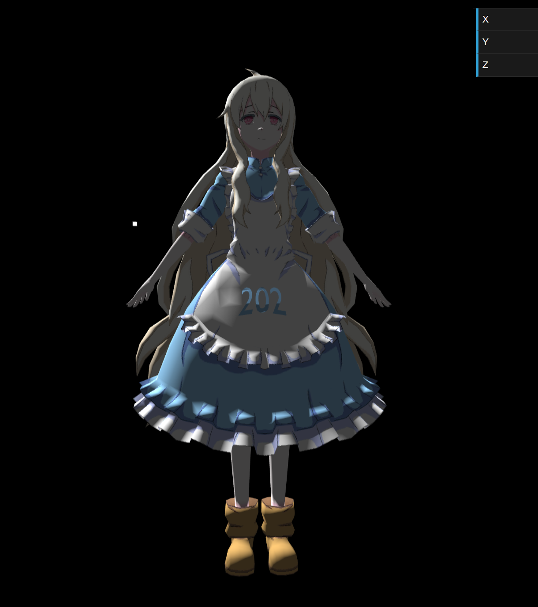

# GAMES202 Assignment 0

Environment setup and Phong shader implementation


## Demonstration




## Issues

The user may experience "random" failures upon loading the webpage. The model may not be properly loaded.

- Append the following code snippet to the head of `index.html` file to allow the textures to be loaded first.

  ```html
  <!DOCTYPE html>
  <html>
  
  <link rel="preload" href="assets/mary/MC003_Kozakura_Mari.png" as="image" type="image/png" crossorigin/>
  ```

  
