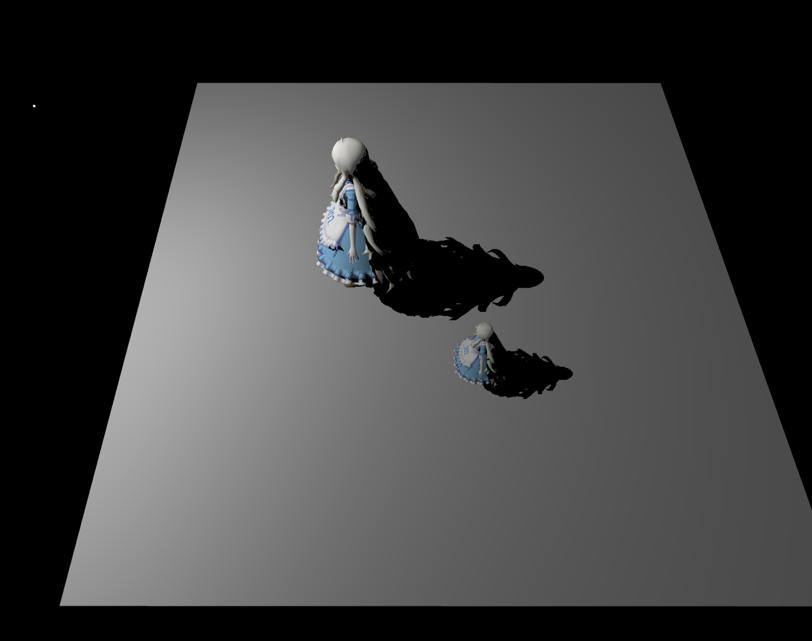
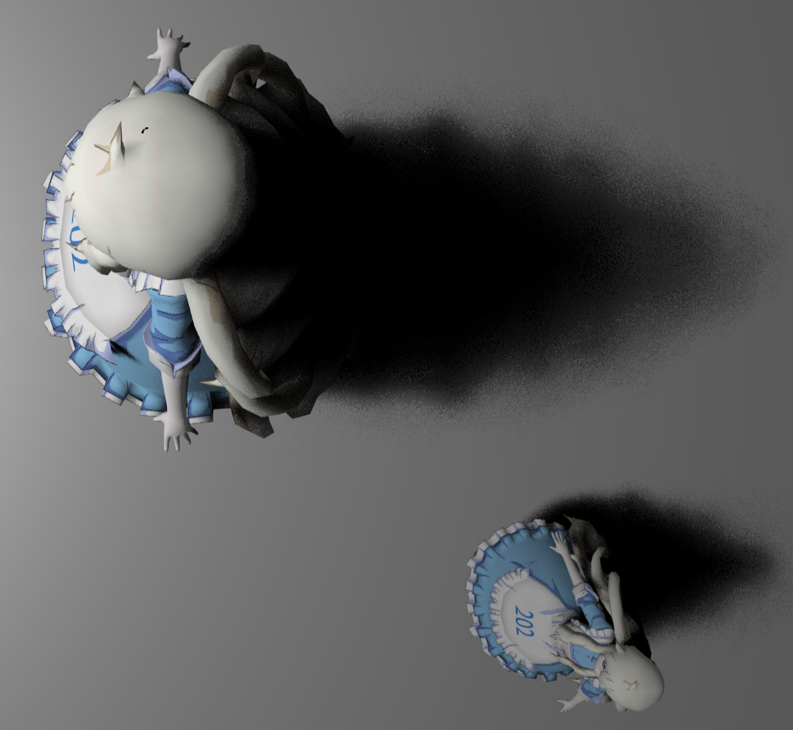
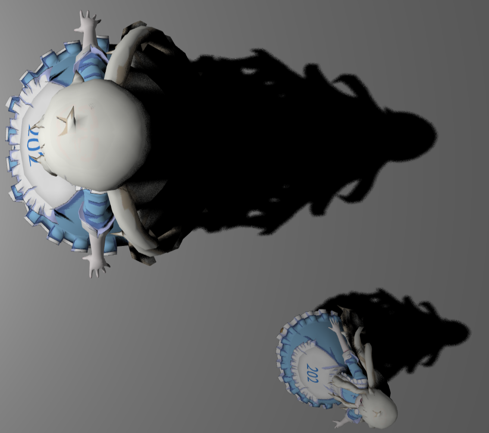
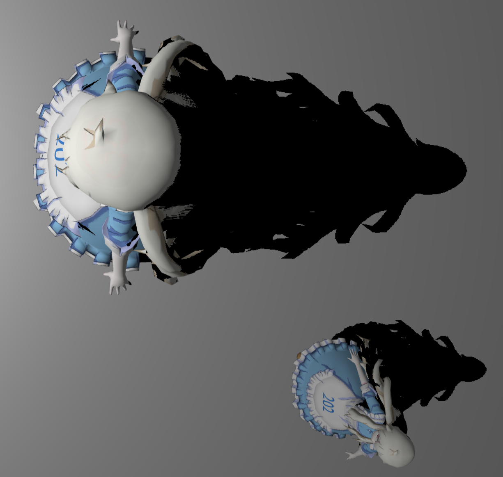
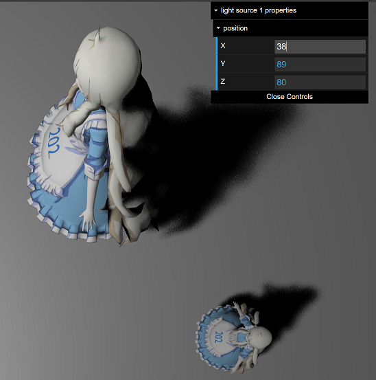
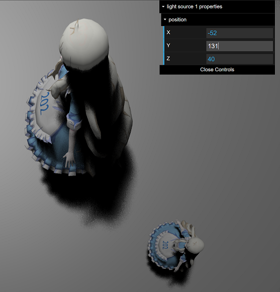

# GAMES202 Assignment 1

## Features Implemented

| Name                          | Score |
| ----------------------------- | ----- |
| Shadow Map                    | 5     |
| PCF                           | 10    |
| PCSS                          | 5     |
| Shadow Map and Dynamic Object | 15    |


## Demonstration

### Shadow Map




### PCF and PCSS

| With PCSS                                     | With PCF                                     | No PCF                                       |
| --------------------------------------------- | -------------------------------------------- | -------------------------------------------- |
|  |  |  |


### Multiple Light Sources and Dynamic Objects

#### Dynamic Objects (Realtime Shadow Mapping)





**Implementation**: Update the `ShadowMap` per frame. If required, the behavior can be modified to update only after positions of some objects inside the light frustum have changed.


#### Multiple Lights (2 Lights)


## Issues

### Bias

Adjusting epsilon used in shadow mapping to `5e-3` solves shadow acne.


### Model Loading

The user may experience "random" failures upon loading the webpage. The model may not be properly loaded.

- Append the following code snippet to the head of `index.html` file to allow the textures to be loaded first.

  ```html
  <!DOCTYPE html>
  <html>
  
  <link rel="preload" href="assets/mary/MC003_Kozakura_Mari.png" as="image" type="image/png" crossorigin/>
  ```


