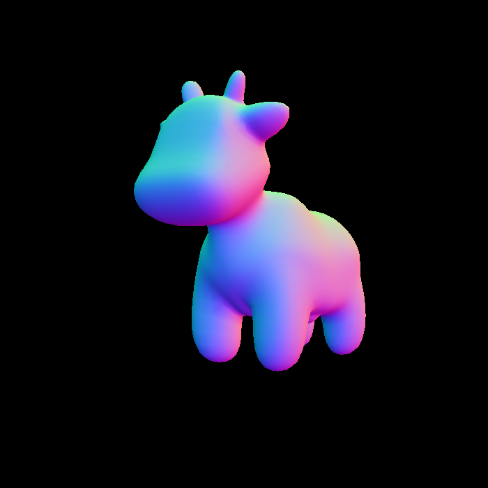
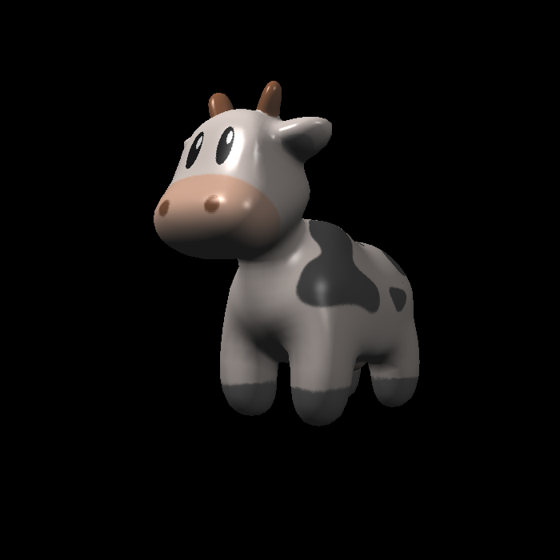
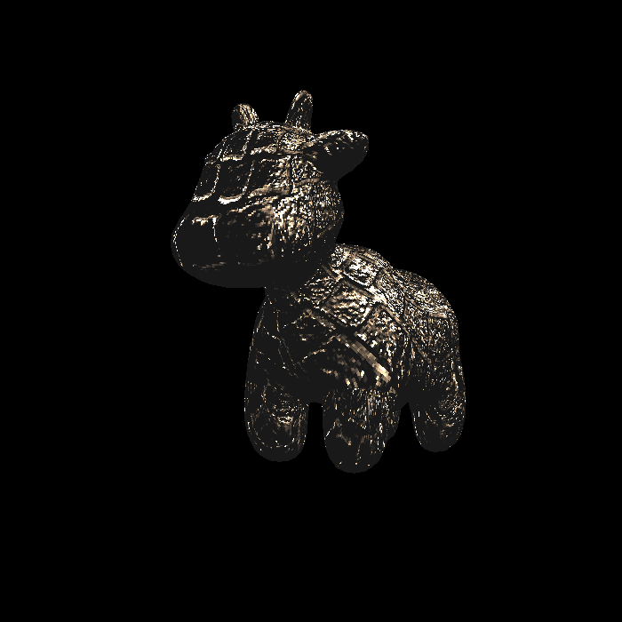
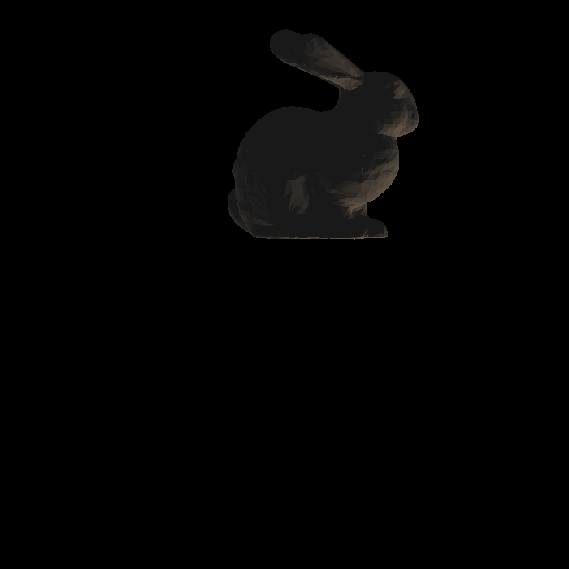
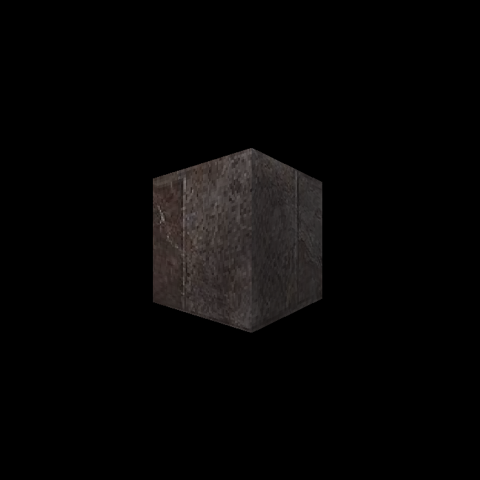
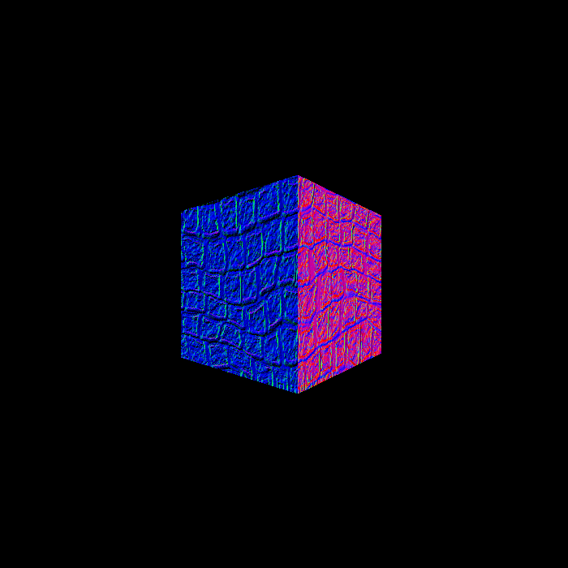
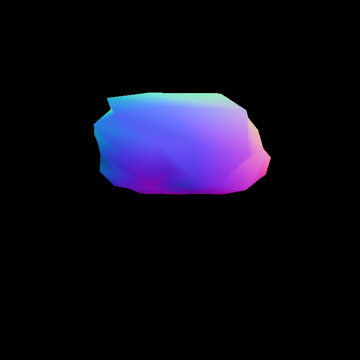
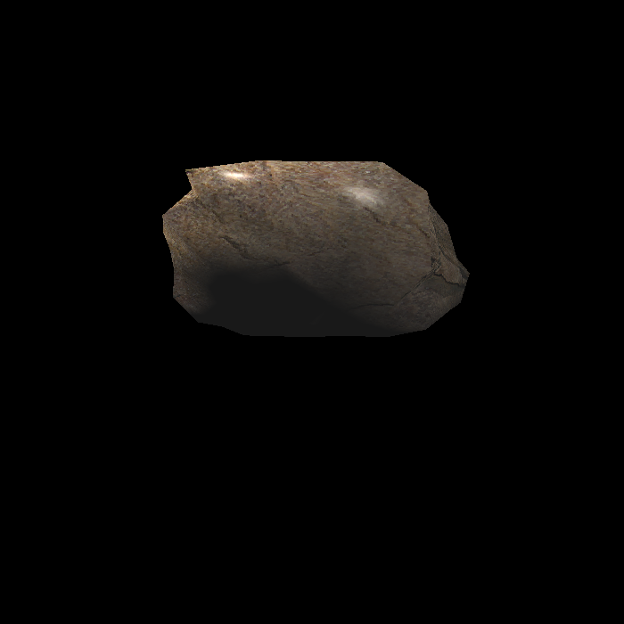

# GAMES101 Assignment 3
## Demonstration
### Spot








### Bunny




### Cube







### Rock





## Known issues related to the framework
1. Inside function `phong_fragment_shader`,
   ```
        Eigen::Vector3f v = (eye_pos - point).normalized(); // WARNING: Calculating eye_pos in world space with shading point from view space.
   ```
   is an incorrect implementation, as the comment suggests. However, this leads to the result that matches the sample image in the Assignment description.
2. Unspecified coordinate space for `light.position`s. Assuming they are all in the view space.
3. Interpolation done in viewport space rather than in the view space.


## Known problems
1. Why do we calculate the ambient lighting for each light source instead of applying it for only once?
2. Self-implemented perspective correct interpolation resulted in unexpected artifacts.